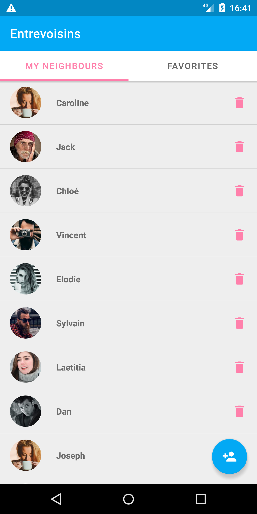
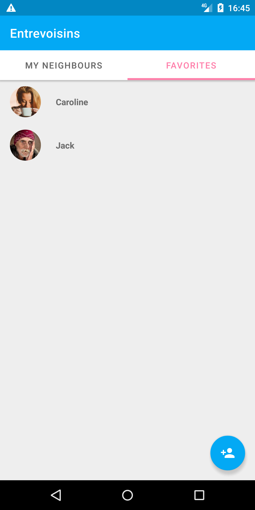
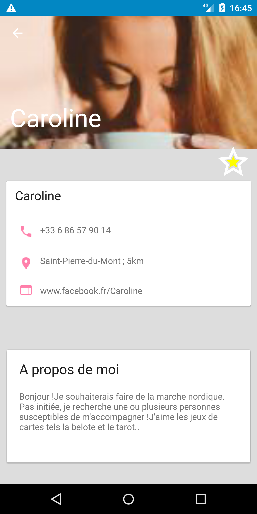

# EntreVoisins Application du projet 3 OpenClassrooms
--------------------

Les fonctionnalités déjà présente dans l'application : 

* Lister les voisins.
* Ajouter un voisin.
* Supprimer un voisin.

Les fonctionnalités développé durant le projet :

* Un onglet favoris dans lequel les utilisateurs marqués comme favoris s'affichent.

Au clic sur un utilisateur :

* Un bouton de retour à l'élément précédent.
* L'avatar de l'utilisateur.
* Le nom de l'utilisateur.
* Un bouton d'ajout du voisin à la liste de favoris.

## Phone display

&ensp;

## Add & delete favorites

&ensp;

### App Architecture

* Java

### Library

* ButterKnife
* Espresso

1 ->Press "clone or download"
2 -> Download zip
3 -> Unzip 
4 -> In Projet-3-Partage-master .Open repository "P3_02_code" with Android Studio
5 -> Wait Android Studio auto build (on SDK 28) or build
6 -> Run on AVD (min21/max28)
